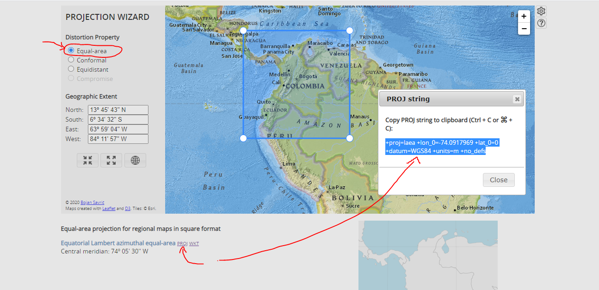

```{r}
knitr::opts_chunk$set(fig.align = "center",
                      warning = FALSE,
                      message = FALSE,
                      fig.width = 9)
```


- Notas tomadas del curso ["Sistemas de Información Geográfica en R (SIG en R)" con Derek Corcoran.](https://www.youtube.com/channel/UCOb-12wuWVtrWfqI3p8HL4w)

<iframe width="560" height="315" src="https://www.youtube.com/embed/v71pC7yddo0" frameborder="0" allowfullscreen></iframe>

# Generalidades

- Datos
  - Datos de captura remota (satelites lidar)
  - Datos modelados (SDM)
  - Datos de expertos
  - Planes futuros
- Formatos
  - Datos vectoriales (.shp --> Shapefiles)
    - Puntos --> Ciudades, eventos, sitio de muestreo
    - Líneas
    - Polígonos
  - Datos en grilla (raster)

# Shapefiles
  
## Data countriesHigh

```{r}
library(sf)
library(tidyverse)
library(rworldxtra)
data("countriesHigh")
class(countriesHigh)
```

## Objeto sf

- **Transformación a objeto sf (simple feature):** este tipo de objeto es más moderno que el tipo *sp* para manejar datos espaciales. También facilita la conversión a data.frame, de tal manera que se facilita el manejo a través del *tidyverse*.

```{r}
mundo <- st_as_sf(countriesHigh)
class(mundo)
```

## Gráficos

- **Gráfico con gggplot2:**

```{r, fig.align="center"}
mundo %>% 
  ggplot(aes(fill = POP_EST)) +
  geom_sf() +
  labs(title = "Población mundial")
```

- **Filtrando sólo África:**

```{r}
library(viridis)
mundo %>% 
  filter(continent == "Africa") %>% 
  ggplot(aes(fill = POP_EST)) +
  geom_sf() +
  scale_fill_viridis_c()
```

## Exportando shape

- **Exportando subconjunto de datos como .shp:**

```{r}
mundo %>% 
  filter(continent == "Africa") %>% 
  dplyr::select(NAME, POP_EST, GDP_MD_EST, GLOCAF) ->
  africa
write_sf(africa, "ejemplo_africa.shp")
```

- **Lectura de archivo shape:**

```{r}
# Función biblioteca raster
africa2 <- shapefile("ejemplo_africa.shp")
class(africa2)

#Función biblioteca sf
africa3 <- read_sf("ejemplo_africa.shp") 
class(africa3)
```

- **Gráficos por defecto con la función plot():**

```{r}
plot(africa2)
plot(africa3)
```
## Obtención de shapes con R

- Los nombres ISO-3 de cada país se pueden obtener de la siguiente manera:

```{r}
getData(name = "ISO3")
```

- **Obtención de datos con función getData() para Colombia:**

  - `level = 0`: división a nivel de país.
  - `level = 1`: división regional (departamentos)
  - `level = 2`: división municipal (municipios)

```{r}
colombia <- getData(name = "GADM", country = "COL", level = 0)
colombia_sf <- st_as_sf(colombia)
colombia_sf %>% 
  ggplot() + 
  geom_sf()
```

- Proyección del sistema de coordenadas de objetos "colombia" y "colombia_sf":

```{r, warning=FALSE, message=FALSE}
crs(colombia)
crs(colombia_sf)
```


- Añadiendo punto al mapa. Con el formato sf es posible hacer esto facilmente con ggplot2. Es necesario ingresar a la función `st_as_sf()` la posición de las columnas longitud y latitud, respectivamente. Además es necesario incoporar la proyección del sistema de coordenadas.

```{r}
prueba <- data.frame(lon = -70, lat = 5, punto = "ejemplo")

prueba %>% 
  st_as_sf(coords = c(1, 2),
           crs = "+proj=longlat +ellps=WGS84 +towgs84=0,0,0,0,0,0,0 +no_defs") ->
  prueba_sf
prueba_sf
```

- Gráfico de shape + punto creado previamete:

```{r}
ggplot() + 
  geom_sf(data = colombia_sf)  +
  geom_sf(data = prueba_sf, color = "red", size = 4)
```
# Raster

- Datos en grilla, similares a una imagen (pixeles). Poseen características de resolución, proyección, unidades (m, km, ...)

## Datos CHELSA

- Individuales:

```{r}
raster1 <- raster("images-tif/CHELSA_Bio1_4km2.tif")
raster2 <- raster("images-tif/CHELSA_Bio6_4km2.tif")
raster1
raster2
```

- Stack de raster: es posible almacenar varios raster en un sólo objeto.

```{r}
mi_stack <- stack(raster1, raster2)
mi_stack
```

## Gráficos

```{r}
plot(mi_stack, colNA = "black")
```
- **Escalas equivalentes:** a través de la biblioteca rasterVis es posible generar mapas que compartan la misma leyenda.

```{r}
library(rasterVis)
levelplot(mi_stack)
```

## Operaciones simples

- Suma de raster:

```{r, fig.width=9}
total <- mi_stack[[1]] + mi_stack[[2]]
levelplot(total)
```

- Promedios:

```{r, fig.width=9}
promedios <- mean(mi_stack)
levelplot(promedios)
```

## Corte de raster

- Es posible cortar el raster para una región específica, en este caso sólo para Colombia. La función crop() permitirá extraer el cuadrante donde se encuenta la región de interés.

```{r, fig.width=9}
raster_colombia <- promedios %>% crop(colombia_sf) # también funciona: crop(colombia)
levelplot(raster_colombia)
```

- Gráfico con la biblioteca base:

```{r}
plot(raster_colombia, colNA = "black")
```

- **Corte de sólo Colombia:** además de la función crop() es necesario utilizar la función mask(), ambas de la biblioteca raster.

```{r, fig.width=9}
solo_colombia <- promedios %>% 
  crop(colombia_sf) %>% 
  mask(colombia_sf)
levelplot(solo_colombia)
```
- Gráfico con la biblioteca base:

```{r}
plot(solo_colombia, colNA = "black")
```

## Extracción de valores

- Con los datos creados previamente para representar un punto dentro del mapa, se ejemplifica la extracción de valores del raster (temperatura en este caso) correspondiente a la respectiva longitud y latitud. En este caso equivale a 236. **Nota:** recordar que los valores de las variables bioclimáticas están multiplicados por 10, de tal manera que la temperatura para el punto ficticio es 236/10 = 23.6°C.

```{r, warning=FALSE, message=FALSE}
extract(solo_colombia, prueba_sf)
```

- Se podría añadir este valor a la base de datos:

```{r, warning=FALSE, message=FALSE}
prueba_sf$temperatura <- extract(solo_colombia, prueba_sf)
prueba_sf
```

- También es posible aplicar el proceso anterior sobre un stack de raster:

```{r, warning=FALSE, message=FALSE}
extract(mi_stack, prueba_sf)
cbind(prueba_sf, extract(mi_stack, prueba_sf)) %>% 
  as.data.frame()
```
## Exportar raster

```{r}
writeRaster(solo_colombia, "colombia.grd", overwrite = TRUE)
```

- **Lectura del raster:**

```{r}
nuevo_col <- raster("colombia.grd")
plot(nuevo_col, colNA = "black")
```

# Proyecciones

- Importante cuando el área del pixel ingresa en los calculos del análisis, por ejemplo, cuando se está obteniendo abundancia (relativa) de especies. Lugares cercanos al ecuador podrían tener tamaños más grandes de pixel y ocasionar sesgo si no se controla la proyección. En la página web de [Projection Wizard](https://projectionwizard.org/) es posible obtener proyecciones para lugares específicos, garantizando así que tenemos un mapa de igual área. En este caso para colombia la proyección se muestra en la siguiente imagen:

<center>

</center>

<br> 

- Para más información acerca de proyecciones geográficas, recomiendo ver el siguiente video.

<iframe width="560" height="315" src="https://www.youtube.com/embed/sEakd8Aylv4" frameborder="0" allowfullscreen></iframe>

- **Proyección inicial:**

```{r}
proj4string(solo_colombia)
```

- **Cambiando proyección:**

```{r, warning=FALSE, message=FALSE}
colombia_igual <- projectRaster(
  solo_colombia,
  crs = "+proj=laea +lon_0=-74.0917969 +lat_0=0 +datum=WGS84 +units=m +no_defs"
)
plot(colombia_igual, colNA = "black")

```

# Shape + Raster

- Conversión de raster a base de datos (data.frame).

```{r}
colombia_data <- solo_colombia %>% 
  as("SpatialPixelsDataFrame") %>% 
  as.data.frame()
head(colombia_data)
```

- Mapa con gggplot2:

```{r}
# Opcional: cambiando nombre de variable layer
colombia_data <- colombia_data %>% dplyr::rename(Temp = layer)

# Gráfico
ggplot() +
  geom_tile(data = colombia_data, aes(x = x, y = y, fill = Temp)) +
  geom_sf(data = colombia_sf, alpha = 0) +
  scale_fill_viridis_c() +
  theme_bw()
``` 


# Recursos recomendados

- [Diva-GIS](https://www.diva-gis.org/gdata)
- [Spatial Data Science with R](https://rspatial.org/)
- [Worldclim](https://worldclim.org/data/v1.4/formats.html)
- [CHELSA](https://chelsa-climate.org/)
- [Projection Wizard](https://projectionwizard.org/)


