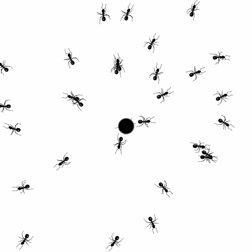

```{r}
knitr::opts_chunk$set(fig.align = "center",
                      warning = FALSE,
                      message = FALSE,
                      fig.width = 9)
```


- Notas tomadas del curso ["Sistemas de Información Geográfica en R (SIG en R)" con Derek Corcoran.](https://www.youtube.com/watch?v=9e-zDQPGhBo&ab_channel=DerekCorcoran)

<iframe width="560" height="315" src="https://www.youtube.com/embed/9e-zDQPGhBo" frameborder="0" allowfullscreen></iframe>

# Bibliotecas

```{r}
library(rworldxtra)
library(tidyverse)
library(sf)
library(raster)
```

# Datos Formicidae (Hormigas)

<center>

</center>

- Ver anexos para obtener código de la base de datos que se carga a continuación.
- Estos datos están en [este directorio de Github.](https://github.com/Edimer/Spatial-Data-Science/blob/main/SIG_R/data/Formicidae.csv)

```{r, warning=FALSE, message=FALSE}
datos <- read_csv("https://raw.githubusercontent.com/Edimer/Spatial-Data-Science/main/SIG_R/data/Pheidole.csv")
datos
```

## Transformación a sf

- En el argumento `coords` se incorpora un vector con la posición de las columnas longitud y latitud, respectivamente.
- El sistema de coordenadas elegido en el siguiente código es el más sencillo de todos, sin embargo, se puede cambiar ([ver clase 01](https://rpubs.com/Edimer/673433)).

```{r}
# Datos a sf
datos_sf <- datos %>% 
  st_as_sf(coords = c(5, 6), crs = "+proj=longlat +ellps=WGS84 +datum=WGS84 +no_defs +towgs84=0,0,0")
```

## Área de estudio {.tabset .tabset-fade .tabset-pills}

### Área en Colombia

```{r, warning=FALSE, message=FALSE}
colombia <- getData(name = "GADM", country = "COL", level = 0)
colombia_sf <- st_as_sf(colombia)
colombia_sf %>% 
  ggplot() + 
  geom_sf() +
  geom_sf(data = datos_sf, aes(color = Species))

table(datos_sf$Species)
```

### Área específica

- El siguiente mapa corresponde a una región específica de Colombia.

```{r, warning=FALSE, message=FALSE}
# Mapa del mundo
data("countriesHigh")
mapa <- countriesHigh %>% 
  st_as_sf() %>%
  st_crop(datos_sf)
ggplot() +
  geom_sf(data = mapa) +
  geom_sf(data = datos_sf)
```


# Anexos

- En el ejemplo de clase se trabaja con la especie Bombus affinis (abejorros), sin embargo, obtuve directamente la base de datos de [PREDICTS database](https://data.nhm.ac.uk/dataset/the-2016-release-of-the-predicts-database) y voy a trabajar con la familia  de insectos [*Formicidae*,](https://es.wikipedia.org/wiki/Formicidae), que incluye todas las hormigas.
-  En este caso filtro información sólo para Colombia.
- Se filtran datos sólo de abundancia de especies.
- Mantengo sólo las siguientes variables:
  - **Reference:** referencia del estudio
  - **Study_common_taxon:** taxón
  - **Site_name:** nombre de sitio
  - Sampling_effort
  - Longitude
  - Latitude
  - Species
  - **Measurement:** medida de abundancia
  - Effort_corrected_measurement

```{r}
# Base de datos total con más de 3 millones de registros
datos_total <- fread("database.csv", encoding = "UTF-8")

# Filtro solenopsis para Colombia: 551 registros de abundancia
datos_colombia <- datos_total %>% 
  filter(Country == "Colombia") %>% 
  filter(Family == "Formicidae") %>%  
  filter(Diversity_metric_type == "Abundance") %>% 
  select(Reference, Study_common_taxon, Site_name, Sampling_effort,
         Longitude, Latitude, Species, Measurement, 
         Effort_corrected_measurement) 


# Exportando datos de formicidae
write.csv(datos_colombia, file = "Formicidae.csv", row.names = FALSE,
          fileEncoding = "UTF-8")
```


