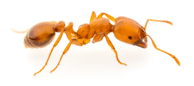

```{r}
knitr::opts_chunk$set(fig.align = "center",
                      warning = FALSE,
                      message = FALSE,
                      fig.width = 9)
```


- Notas tomadas del curso ["Sistemas de Información Geográfica en R (SIG en R)" con Derek Corcoran.](https://www.youtube.com/watch?v=9e-zDQPGhBo&ab_channel=DerekCorcoran)

<iframe width="560" height="315" src="https://www.youtube.com/embed/9e-zDQPGhBo" frameborder="0" allowfullscreen></iframe>

# Bibliotecas

```{r}
library(rworldxtra)
library(tidyverse)
library(sf)
library(raster)
```

# Datos Solenopsis

<center>

</center>

- Ver anexos para obtener código de la base de datos que se carga a continuación.
- Estos datos están en [este directorio de Github.](https://github.com/Edimer/Spatial-Data-Science/blob/main/SIG_R/data/solenopsis.csv)

```{r, warning=FALSE, message=FALSE}
datos <- read_csv("https://raw.githubusercontent.com/Edimer/Spatial-Data-Science/main/SIG_R/data/solenopsis.csv")
datos
```

## Transformación a sf

- En el argumento `coords` se incorpora un vector con la posición de las columnas longitud y latitud, respectivamente.
- El sistema de coordenadas elegido en el siguiente código es el más sencillo de todos, sin embargo, se puede cambiar ([ver clase 01](https://rpubs.com/Edimer/673433)).

```{r}
# Datos a sf
datos_sf <- datos %>% 
  st_as_sf(coords = c(5, 6), crs = "+proj=longlat +ellps=WGS84 +datum=WGS84 +no_defs +towgs84=0,0,0")
```

## Área de estudio {.tabset .tabset-fade .tabset-pills}

### Área en Colombia

```{r, warning=FALSE, message=FALSE}
colombia <- raster::getData(name = "GADM", country = "COL", level = 0)
colombia_sf <- st_as_sf(colombia)
colombia_sf %>% 
  ggplot() + 
  geom_sf() +
  geom_sf(data = datos_sf)
```

### Área específica

- El siguiente mapa corresponde a una región específica de Colombia.

```{r, warning=FALSE, message=FALSE}
# Mapa del mundo
data("countriesHigh")
mapa <- countriesHigh %>% 
  st_as_sf() %>%
  st_crop(datos_sf)
ggplot() +
  geom_sf(data = mapa) +
  geom_sf(data = datos_sf)
```

## Otros mapas

- **Gráfico con color por especie y tamaño por abundancia:** filtro los NA para que no aparezcan en la leyenda.

```{r}
ggplot() +
  geom_sf(data = mapa) +
  geom_sf(data = datos_sf %>% filter(!is.na(Species)),
          aes(color = Species, size = Measurement))
```

- **Gráfico por especie:** filtro los NA para que no aparezcan en la leyenda.

```{r}
ggplot() +
  geom_sf(data = mapa) +
  geom_sf(data = datos_sf %>% filter(!is.na(Species)),
          aes(color = Species, size = Measurement)) +
  facet_wrap(~Species)
```

## Resumen descriptivo

```{r, warning=FALSE, message=FALSE}
datos %>% 
  group_by(Species) %>% 
  summarise(Total = n(),
            AbundanciaPromedio = mean(Measurement),
            MáximoAbundancia = max(Measurement),
            MínimoAbundancia = min(Measurement))
```

# Modelación

## Especie Geminata

- Para los ejemplos siguientes sólo uso la especie *Geminata*. Se observa mayor abundancia en el norte de Colombia.

```{r}
data_geminata <- datos_sf %>% filter(Species == "geminata")
ggplot() +
  geom_sf(data = mapa) +
  geom_sf(data = data_geminata, aes(size = Measurement))
```

## Datos ambientales

- [Aquí](https://www.worldclim.org/data/bioclim.html) puede encontrar información acerca de las variables bioclimáticas que se descargan con el siguiente código.
- Se realiza el corte del área de interés con la función crop() del paquete raster.
  - Cuando utilizamos formato shape usamos la función st_crop y con formatos raster utilizamos la función crop().

```{r, fig.width=9, fig.height=10}
clima <- getData("worldclim", var = "bio", res = 2.5)
clima2 <- clima %>% crop(data_geminata)
plot(clima2)
```

- **Número de capas o variables bioclimáticas:**

```{r}
nlayers(clima2)
```

- Para el ejemplo sólo uso las capas 1, 7, 12, 15 y 19. La elección la hago de forma aleatoria para el ejemplo.

```{r}
clima3 <- clima2[[c(1, 7, 12, 15, 19)]]
```


## Extracción de datos

- **Variables bioclimáticas:** algunos puntos quedan con valores NA para las variables bioclimáticas.

```{r, message=FALSE, warning=FALSE}
clima_data <- extract(clima3, data_geminata) %>% 
  as.data.frame()
clima_data
```

- **Uniendo datos de abundancia con variables bioclimáticas:**

```{r}
data_final <- data_geminata %>% 
  bind_cols(clima_data)
data_final
```

## Relaciones {.tabset .tabset-fade .tabset-pills}

- **Nota:** para esta especie en particular el número de datos es bajo.

### Lineales

```{r, warning=FALSE, message=FALSE}
data_final %>% 
  as.data.frame() %>% 
  dplyr::select(bio1:bio19, Measurement) %>% 
  gather(key = "key", value = "value", -Measurement)  %>% 
  ggplot(aes(x = value, y = Measurement)) +
  facet_wrap(~key, scales = "free", ncol = 3) +
  geom_point() +
  geom_smooth(method = "lm", color = "red", se = FALSE) +
  theme_bw()
```

### Lineales (Logaritmos de abundancia)

```{r, warning=FALSE, message=FALSE}
data_final %>% 
  as.data.frame() %>% 
  dplyr::select(bio1:bio19, Measurement) %>% 
  gather(key = "key", value = "value", -Measurement)  %>% 
  ggplot(aes(x = value, y = Measurement)) +
  facet_wrap(~key, scales = "free", ncol = 3) +
  geom_point() +
  geom_smooth(method = "lm", color = "red", se = FALSE) +
  scale_y_log10() +
  theme_bw()
```

## Modelos {.tabset .tabset-fade .tabset-pills}

- Se prueban tres modelos y basado en el criterio de información de Akaike se elige el mejor.
  - El primero modelo es una regresión poisson, es decir, un modelo lineal generalizado con distribución de errores Poisson.
  - El segundo es un modelo de regresión poisson con un polinomio de segundo grado para bio1 y bio15.
  - El tercero es un modelo aditivo generalizado (GAM).

### GLM Poisson

```{r}
modelo1 <- glm(Measurement ~ bio1 + bio7 + bio12 + bio15 + bio19,
               data = data_final, family = "poisson")
summary(modelo1)
```

- **Residuales:**

```{r}
par(mfrow = c(2,2))
plot(modelo1)
```

### GLM Poisson + Polinomio 2

```{r}
modelo2 <- glm(Measurement ~ I(bio1^2) + bio7 + bio12 + I(bio15^2) + bio19,
               data = data_final, family = "poisson")
summary(modelo2)
```

- **Residuales:**

```{r}
par(mfrow = c(2,2))
plot(modelo2)
```

### GAM

```{r}
library(mgcv)
modelo3 <- gam(Measurement ~ s(bio1, k = 4) + s(bio7, k = 5) + 
                 bio12 + bio15 + bio19 + bio1 + bio7,
               data = data_final, family = "poisson")
summary(modelo3)
```

- **Residuales:**

```{r}
par(mfrow = c(2, 2))
gam.check(modelo3)
```
### Mejor Modelo

- Es mejor el modelo GAM (AIC más bajo). Con este modelo se realizan las predicciones de abundancia.

```{r}
AIC(modelo1, modelo2, modelo3)
```

## Predicciones

- **Nota:** dado el bajo número de datos (51 registros) para la especie bajo análisis, no se logra construir un modelo que proporcione abundancias predichas correctamente. Cabe mencionar que es posible mejorar el análisis incluyendo más información de la especie o ajustando otros modelos.

```{r}
prediccion <- predict(clima3, modelo2, type = "response")
plot(prediccion, colNA = "black")
```

- **Mapa con ggplot2:**

```{r}
prediccion_df <- prediccion %>% 
  as("SpatialPixelsDataFrame") %>% 
  as.data.frame() %>% 
  rename(Abundancia = layer)

ggplot() +
  geom_tile(data = prediccion_df, aes(x = x, y = y, fill = Abundancia)) +
  geom_sf(data = mapa, alpha = 0) +
  scale_fill_viridis_c() +
  theme_bw()
```

## Predicciones futuras

- **Imágenes futuras:** las mismas con las cuales se entrenó el modelo.

```{r, warning=FALSE, message=FALSE}
futuro <- raster::getData("CMIP5", var = "bio", res = 2.5, rcp = 85,
                          model = "HD", year = 70) %>% 
  crop(data_geminata)

futuro <- futuro[[c(1, 7, 12, 15, 19)]]
names(futuro) <- c("bio1", "bio7", "bio12", "bio15", "bio19")
plot(futuro)
```

- **Mapa de predicción de abundancia:**

```{r, warning=FALSE, message=FALSE}
prediccion_futura <- predict(futuro, modelo2, type = "response")

prediccion_df_futuro <- prediccion_futura %>% 
  as("SpatialPixelsDataFrame") %>% 
  as.data.frame() %>% 
  rename(Abundancia = layer)

ggplot() +
  geom_tile(data = prediccion_df_futuro, aes(x = x, y = y, fill = Abundancia)) +
  geom_sf(data = mapa, alpha = 0) +
  scale_fill_viridis_c() +
  theme_bw()
```


# Anexos

- En el ejemplo de clase se trabaja con la especie Bombus affinis (abejorros), sin embargo, obtuve directamente la base de datos de [PREDICTS database](https://data.nhm.ac.uk/dataset/the-2016-release-of-the-predicts-database) y voy a trabajar con el género de hormigas [*Solenopsis*,](https://es.wikipedia.org/wiki/Solenopsis) también conocida como hormiga colorada o de fuego..
-  En este caso filtro información sólo para Colombia.
- Se filtran datos sólo de abundancia de especies.
- Mantengo sólo las siguientes variables:
  - **Reference:** referencia del estudio
  - **Study_common_taxon:** taxón
  - **Site_name:** nombre de sitio
  - Sampling_effort
  - Longitude
  - Latitude
  - Species
  - **Measurement:** medida de abundancia
  - Effort_corrected_measurement

```{r}
# Base de datos total con más de 3 millones de registros
datos_total <- fread("database.csv", encoding = "UTF-8")
# Filtro solenopsis para Colombia: 551 registros de abundancia
datos_colombia <- datos_total %>% 
  filter(Country == "Colombia") %>% 
  filter(Genus == "Solenopsis") %>%  
  filter(Diversity_metric_type == "Abundance") %>% 
  select(Reference, Study_common_taxon, Site_name, Sampling_effort,
         Longitude, Latitude, Species, Measurement, 
         Effort_corrected_measurement) 
# Exportando datos de solenopsis
write.csv(datos_colombia, file = "solenopsis.csv", row.names = FALSE,
          fileEncoding = "UTF-8")
```


